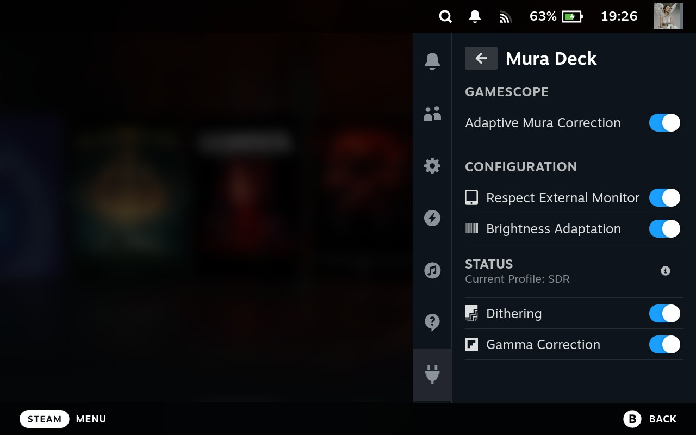

# Mura Corrector Deck | MuraDeck

## Installation
Since the plugin is still in the testing environments. You need to install it manually using Decky Loader.
1. Download the plugin from the release section, save it anywhere on your Steam Deck
2. Navigate to Decky Loader Settings, and activate ``Developer mode``
3. Navigate to Developer and click ``Install Plugin from ZIP file``, browse to your downloaded plugin
4. Done

## Ground Truth
https://github.com/user-attachments/assets/254a30c3-f0c4-4e98-b25e-6407b6a3cd0f

## Features
Install it and forget it. Everything created, to automagically doing everything in the background for you:
- Mura correction only on your bright pixel, to preserve pure black
- Automatically shader switching between SDR/HDR profile (HDR PQ, HDR scRGB, and SDR)
- Brightness adaptation, designed to adapt the mura map strength with the current brightness
- Respect external monitor, automatically disable the plugin when external monitor connected
- Automatically re-use previous shader when wake events detected
- Automatically runs on boot
- Dithering only on dark areas, by using film grain
- Gamma correction on dark areas

Feel free to report a bug, if some of these features not working.

## Known Limitations
Shaders are designed to work with landscape 16:xx aspect ratio. Other than 16:xx ratios will causing mura looks worse, since it's designed to stretch to horizontal.

During development, it was tested using `xwininfo` to get current window resolution. The difficulty starts, when trying to achieve the timing to trigger the ``xwininfo``. If some of you able to tackle this limitation, feel free to contribute to the project.

## TL;DR
Average Samsung-panel on Steam Deck have known-issues called Mura Effect and raised gamma, where it has bad gray-uniformity on certain Hz and brightness. Resulting, grainy/dirty looks on the screen which can consider looks like a noise or film grain. Causing gradient effects on near-black looks like banding when fading into black. **While the current fix provided from valve unfortunately is raising the black level with the mura map keep showing on the black pixel.**

In a nutshell, **you can fix it by set your screen hertz between 47hz-66hz and set your brightness between 35/40%, and disable mura compensation on developer settings**. And you will get the screen where it should be, perfect black and nice gradient on near-black. **But this is not apply with higher brightness.**

This fix will use combination between **film grain for dithering, lift & gamma (only on near-black pixel)** and your **mura map (only on your bright pixel)**. While **this is not perfect**, atleast it will fix half of the screen issue.

Originally, this plugin development was created to automagically switching between vkBasalt and Gamescope. Since SteamOS 3.7.8 the development scope is switching into full Gamescope reshade, since the reshade is gain a performance update.

## Credits
Shaders & plugin is developed by MoonVeil Kanata ~ RenvyRere.
## References
- Film Grain - Christian Cann Schuldt Jensen ~ CeeJay.dk
- Lift Gamma Gain - 3a and CeeJay.dk

## License
Licensed under GPLv3 License.