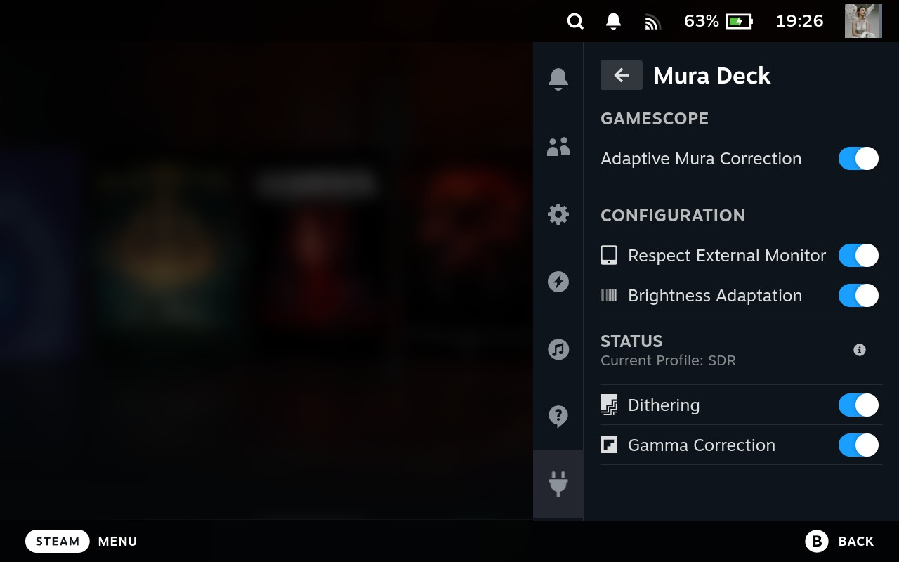

# MuraDeck

>MuraDeck is originally developed to automagically switching between vkBasalt and Gamescope to fix your mura issue with better performance. Since SteamOS 3.7.8 the development scope is switching into full Gamescope reshade, since the reshade is gaining a performance update.

## 🔵 Functionality
Install it and forget it. Everything is created, to automagically doing everything in the background for you:
- Your mura map and the shaders, will extracted automatically during installation process
- Mura correction, only on your bright pixel. To preserve pure black
- Automatically shader switching, between SDR/HDR profile (HDR PQ, HDR scRGB, and SDR)
- Brightness adaptation, designed to adapt the mura map strength with the current brightness
- Respect external monitor, automatically disable the plugin when external monitor connected
- Automatically re-use previous shader when wake events detected
- Automatically runs on boot
- Dithering only on dark areas, by using film grain
- Gamma correction on dark areas

Feel free to report a bug, if some of these core functionality not working.

## 🟫 Ground Truth
More test
https://www.reddit.com/r/SteamDeck/comments/1lmemki/actual_mura_fix_plugin_for_your_steam_deck_oled/

https://github.com/user-attachments/assets/254a30c3-f0c4-4e98-b25e-6407b6a3cd0f

## 🟢 Usage
- Download from [Release](https://github.com/Moonveil-Kanata/MuraDeck/releases/), save it to any folder on Steam Deck
- Do a manual Decky Loader installation
- You will be guided to what you need to do before start using the plugin
- Finally, Activate ``Adaptive Mura Correction`` toggle
- Done

## 🔴 Known Limitations
### FSR/Sharp Issue
Currently, SteamOS 3.7.8 FSR/Sharp settings is broken if combined with reshade [ValveGamescope#1903](https://github.com/ValveSoftware/gamescope/issues/1903). Consider to set **Scaling Filter** to **LINEAR**.

You will be guided through the plugin installation.

### Aspect Ratio
Shaders are designed to work with landscape 16:xx aspect ratio. Other than 16:xx ratios will causing mura looks worse, since it's designed to stretch to horizontal, and cropped on vertical.

During development, it was tested using `xwininfo` to get current window resolution. The difficulty starts, when trying to achieve the timing to trigger the ``xwininfo``.

## 🟪 Contributions
Dev, open for any contributions, including:
- If some of you able to tackle those [limitation](#-known-limitations),
- Additional features
- Bug fix

### Feel free to follow the [contribution](./CONTRIBUTION.md) guide.

## 🟡 TL;DR
Average Samsung-panel on Steam Deck non-LE OLED have known-issues called Mura Effect and raised gamma, where it has bad gray-uniformity on certain Hz and brightness. Resulting, grainy/dirty looks on the screen which can consider looks like a noise or film grain. Causing gradient effects on near-black looks like banding when fading into black. **While the current fix provided from valve unfortunately is raising the black level with the mura map keep showing on the black pixel.**

In a nutshell, **you can fix it by set your screen hertz between 47hz-66hz and set your brightness between 35/40%, and disable mura compensation on developer settings**. And you will get the screen where it should be, perfect black and nice gradient on near-black. **But this is not apply with higher brightness.**

This fix will use combination between **film grain for dithering, lift & gamma (only on near-black pixel)** and your **mura map (only on your bright pixel)**. While **this is not perfect**, atleast it will fix half of the screen issue.

## Credits
Shaders & plugin is developed by MoonVeil Kanata ~ RenvyRere.
## References
- Film Grain - Christian Cann Schuldt Jensen ~ CeeJay.dk
- Lift Gamma Gain - 3a and CeeJay.dk

## License
Licensed under GPLv3 License.